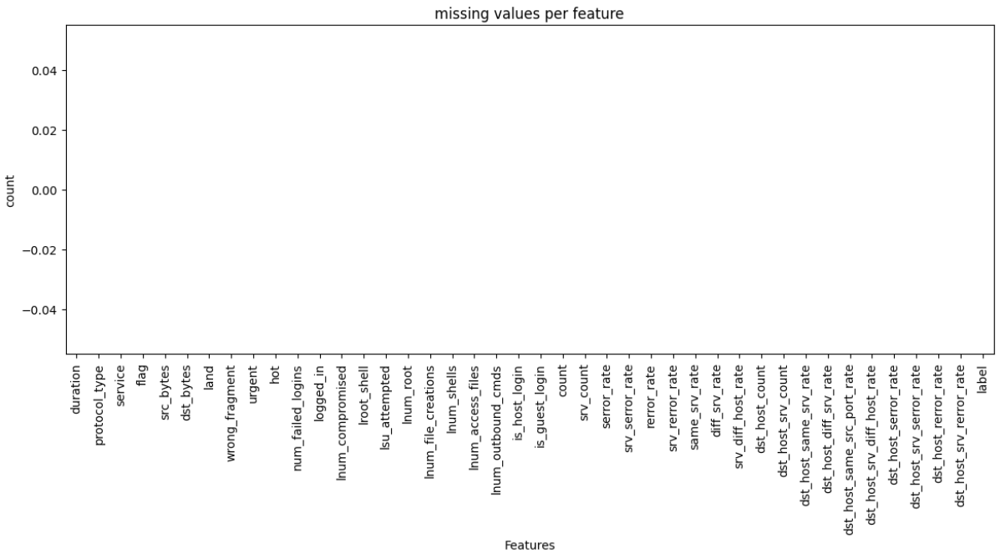
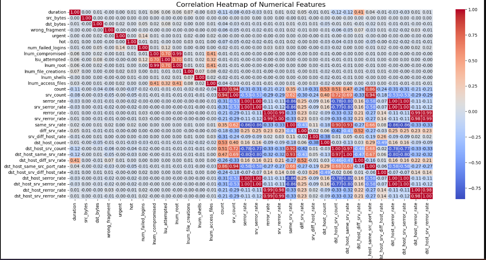
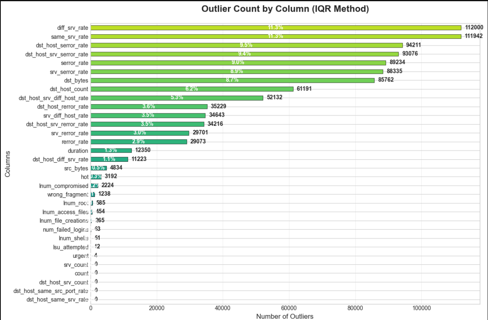

# Exploratory Data Analysis (EDA)
---
## 1. Dataset Overview And Sanity Checks
---
  - **Shape:** (494020, 42)
  - **Datatypes:**  protocol_type, service,  flag and label are in str data types. But later we I will eliminate label column.
  - **Duplicate rows:** There are total 348435 duplicated rows. remainning 145585 rows after elimination.
  ### Description
  ---
  | Feature                         | Count      | Mean       | Std         | Min  | 25%   | 50%   | 75%    | Max          |
|---------------------------------|------------|------------|------------|------|-------|-------|--------|--------------|
| duration                        | 494020.0   | 47.9794    | 707.7472   | 0.0  | 0.0   | 0.0   | 0.0    | 58329.0      |
| src_bytes                       | 494020.0   | 3025.6157  | 988219.1012| 0.0  | 45.0  | 520.0 | 1032.0 | 693375640.0  |
| dst_bytes                       | 494020.0   | 868.5308   | 33040.0347 | 0.0  | 0.0   | 0.0   | 0.0    | 5155468.0    |
| land                            | 494020.0   | 0.000045   | 0.006673   | 0.0  | 0.0   | 0.0   | 0.0    | 1.0          |
| wrong_fragment                  | 494020.0   | 0.006433   | 0.134805   | 0.0  | 0.0   | 0.0   | 0.0    | 3.0          |
| urgent                          | 494020.0   | 0.000014   | 0.005510   | 0.0  | 0.0   | 0.0   | 0.0    | 3.0          |
| hot                             | 494020.0   | 0.034519   | 0.782103   | 0.0  | 0.0   | 0.0   | 0.0    | 30.0         |
| num_failed_logins               | 494020.0   | 0.000152   | 0.015520   | 0.0  | 0.0   | 0.0   | 0.0    | 5.0          |
| logged_in                       | 494020.0   | 0.148245   | 0.355343   | 0.0  | 0.0   | 0.0   | 0.0    | 1.0          |
| lnum_compromised                | 494020.0   | 0.010212   | 1.798328   | 0.0  | 0.0   | 0.0   | 0.0    | 884.0        |
| lroot_shell                     | 494020.0   | 0.000111   | 0.010551   | 0.0  | 0.0   | 0.0   | 0.0    | 1.0          |
| lsu_attempted                    | 494020.0   | 0.000036   | 0.007793   | 0.0  | 0.0   | 0.0   | 0.0    | 2.0          |
| lnum_root                       | 494020.0   | 0.011352   | 2.012720   | 0.0  | 0.0   | 0.0   | 0.0    | 993.0        |
| lnum_file_creations             | 494020.0   | 0.001083   | 0.096416   | 0.0  | 0.0   | 0.0   | 0.0    | 28.0         |
| lnum_shells                     | 494020.0   | 0.000109   | 0.011020   | 0.0  | 0.0   | 0.0   | 0.0    | 2.0          |
| lnum_access_files               | 494020.0   | 0.001008   | 0.036482   | 0.0  | 0.0   | 0.0   | 0.0    | 8.0          |
| lnum_outbound_cmds              | 494020.0   | 0.0        | 0.0        | 0.0  | 0.0   | 0.0   | 0.0    | 0.0          |
| is_host_login                   | 494020.0   | 0.0        | 0.0        | 0.0  | 0.0   | 0.0   | 0.0    | 0.0          |
| is_guest_login                  | 494020.0   | 0.001387   | 0.037211   | 0.0  | 0.0   | 0.0   | 0.0    | 1.0          |
| count                           | 494020.0   | 332.286361 | 213.147107 | 0.0  | 117.0 | 510.0 | 511.0  | 511.0        |
| srv_count                       | 494020.0   | 292.907131 | 246.322736 | 0.0  | 10.0  | 510.0 | 511.0  | 511.0        |
| serror_rate                      | 494020.0   | 0.176687   | 0.380717   | 0.0  | 0.0   | 0.0   | 0.0    | 1.0          |
| srv_serror_rate                  | 494020.0   | 0.176609   | 0.381017   | 0.0  | 0.0   | 0.0   | 0.0    | 1.0          |
| rerror_rate                      | 494020.0   | 0.057434   | 0.231624   | 0.0  | 0.0   | 0.0   | 0.0    | 1.0          |
| srv_rerror_rate                  | 494020.0   | 0.057719   | 0.232147   | 0.0  | 0.0   | 0.0   | 0.0    | 1.0          |
| same_srv_rate                     | 494020.0   | 0.791547   | 0.388190   | 0.0  | 1.0   | 1.0   | 1.0    | 1.0          |
| diff_srv_rate                     | 494020.0   | 0.020982   | 0.082206   | 0.0  | 0.0   | 0.0   | 0.0    | 1.0          |
| srv_diff_host_rate                | 494020.0   | 0.028996   | 0.142397   | 0.0  | 0.0   | 0.0   | 0.0    | 1.0          |
| dst_host_count                     | 494020.0   | 232.471248 | 64.744601  | 0.0  | 255.0 | 255.0 | 255.0  | 255.0        |
| dst_host_srv_count                 | 494020.0   | 188.666052 | 106.040205 | 0.0  | 46.0  | 255.0 | 255.0  | 255.0        |
| dst_host_same_srv_rate             | 494020.0   | 0.753781   | 0.410780   | 0.0  | 0.41  | 1.0   | 1.0    | 1.0          |
| dst_host_diff_srv_rate             | 494020.0   | 0.030906   | 0.109259   | 0.0  | 0.0   | 0.0   | 0.04   | 1.0          |
| dst_host_same_src_port_rate        | 494020.0   | 0.601936   | 0.481309   | 0.0  | 0.0   | 1.0   | 1.0    | 1.0          |
| dst_host_srv_diff_host_rate        | 494020.0   | 0.006684   | 0.042133   | 0.0  | 0.0   | 0.0   | 0.0    | 1.0          |
| dst_host_serror_rate                | 494020.0   | 0.176754   | 0.380593   | 0.0  | 0.0   | 0.0   | 0.0    | 1.0          |
| dst_host_srv_serror_rate            | 494020.0   | 0.176443   | 0.380920   | 0.0  | 0.0   | 0.0   | 0.0    | 1.0          |
| dst_host_rerror_rate                | 494020.0   | 0.058118   | 0.230590   | 0.0  | 0.0   | 0.0   | 0.0    | 1.0          |
| dst_host_srv_rerror_rate            | 494020.0   | 0.057412   | 0.230141   | 0.0  | 0.0   | 0.0   | 0.0    | 1.0          |

---
 ### Interpretation
 The descriptive statistics of the dataset, comprising 494,020 network connection records, reveal a highly skewed and sparse data distribution typical of real-world network traffic. Most continuous features such as duration, source bytes, and destination bytes exhibit strong right-skewness, where mean values are significantly higher than medians due to the presence of extreme outliers. A large number of features have median values of zero, indicating that many security-related events (e.g., failed logins, urgent packets, privilege escalation attempts) occur infrequently. Several binary and rate-based features show values concentrated at 0 or 1, highlighting their effectiveness as indicators of anomalous behavior. Host-based traffic features frequently reach their upper limits, suggesting repeated connections to the same host or service, a pattern often associated with probing or denial-of-service activities. Additionally, some attributes display zero variance and provide no discriminative information, emphasizing the need for careful feature selection and preprocessing before model training.

### categorical

| Feature        | Count  | Unique | Top    | Freq   |
|---------------|--------|--------|--------|--------|
| protocol_type | 494020 | 3      | icmp   | 283602 |
| service       | 494020 | 66     | ecr_i  | 281400 |
| flag          | 494020 | 11     | SF     | 378439 |
| label         | 494020 | 23     | smurf  | 280790 |

 ### Interpretation
 The categorical feature analysis indicates a strong class and traffic-type imbalance within the dataset. The `protocol_type` feature is dominated by ICMP traffic, accounting for more than half of the total observations, which is characteristic of flooding-based attacks. Among the 66 service categories, `ecr_i` appears overwhelmingly frequently, suggesting repetitive exploitation of a specific service. The `flag` feature is heavily concentrated on the `SF` state, indicating that most connections are completed successfully despite malicious intent. Finally, the `label` column shows a pronounced dominance of the `smurf` attack class, confirming that the dataset is highly skewed toward a single denial-of-service attack type. This imbalance has important implications for model training, requiring stratified sampling, resampling techniques, or class-weighted learning to ensure robust and generalizable intrusion detection performance.

 ---

## 2. Missing Value Analysis
  In this dataset, there are no missing values.

 

---
## 3.Feature Type Identification 
The primary objective of this phase is to categorize each feature based on its data type and statistical properties. Proper identification ensures that the mathematical assumptions of Isolation Forest, One-Class SVM, and LOF are satisfied through appropriate encoding and scaling.

### 3.1 Categorical Feature Classification
Categorical features in this dataset are nominal, meaning they represent discrete categories with no inherent rank or order. They are classified by their cardinality (the number of unique values):

| Feature Name   | Cardinality | Level  | Identification                  | Recommended Treatment |
|---------------|-------------|--------|----------------------------------|-----------------------|
| protocol_type | 3           | Low    | icmp, tcp, udp                   | One-Hot Encoding      |
| flag          | 11          | Medium | SF, S0, REJ, etc.                | One-Hot Encoding      |
| service       | 66          | High   | ecr_i, private, http, etc.       | Binary Encoding       |

**Note:** For high-cardinality features like service, Binary Encoding is preferred over One-Hot to prevent the "Curse of Dimensionality," which significantly degrades the performance of distance-based models like **One-Class SVM** and **LOF**.

### 3.2 Binary Feature Handling
  Binary features were retained in their original 0/1 format.
  No additional encoding was applied, as these features were already
  model-compatible and encoding them further would introduce redundancy
  without adding predictive value.

### 3.3 Numerical Feature Handaling
  #### Group A: Highly Right-Skewed (Flow Features)
- **Features:** `src_bytes`, `dst_bytes`, `duration`, `num_compromised`, `num_root`  
- **Observation:** The maximum values are thousands of times larger than the 75th percentile (e.g., `src_bytes` Max: 693M vs 75%: 1,032).  
- **Recommended Treatment:** Log Transformation (`log(x+1)`).  
> This is critical for algorithms like One-Class SVM and LOF to prevent distance metrics from being dominated by extreme outliers.

#### Group B: Saturated Counters & Ratios
- **Features:** `count`, `srv_count`, `serror_rate`, `same_srv_rate`, `dst_host_count`  
- **Observation:** These features are either capped (like `count` at 511) or bounded between 0.0 and 1.0.  
- **Recommended Treatment:** Robust Scaling.  
> Log transformation is not applied here; instead, scaling is done based on percentiles to handle high density of values at the upper bounds (e.g., DoS attack clusters).
---

## 4.MultiCollinearity & Redundency 
  ### 4.1 Corelation Matrix
   

   #### Highly correlated feature pairs

| Feature 1                  | Feature 2                     | Correlation |
|----------------------------|-------------------------------|------------|
| srv_serror_rate            | dst_host_srv_serror_rate      | 0.999304   |
| serror_rate                | dst_host_serror_rate          | 0.998673   |
| serror_rate                | srv_serror_rate               | 0.998362   |
| dst_host_serror_rate       | dst_host_srv_serror_rate      | 0.998156   |
| serror_rate                | dst_host_srv_serror_rate      | 0.997849   |
| srv_serror_rate            | dst_host_serror_rate          | 0.997835   |
| rerror_rate                | srv_rerror_rate               | 0.994731   |
| lnum_compromised           | lnum_root                     | 0.993828   |
| rerror_rate                | dst_host_rerror_rate          | 0.986995   |
| srv_rerror_rate            | dst_host_srv_rerror_rate      | 0.986571   |
| rerror_rate                | dst_host_srv_rerror_rate      | 0.985200   |
| dst_host_rerror_rate       | dst_host_srv_rerror_rate      | 0.984804   |
| srv_rerror_rate            | dst_host_rerror_rate           | 0.982166   |
| dst_host_srv_count         | dst_host_same_srv_rate        | 0.973685   |
| srv_count                  | dst_host_same_src_port_rate   | 0.944926   |
| count                      | srv_count                     | 0.943667   |
| same_srv_rate              | dst_host_same_srv_rate        | 0.927813   |
| same_srv_rate              | dst_host_srv_count            | 0.898960   |
| count                      | dst_host_same_src_port_rate   | 0.860578   |
| serror_rate                | same_srv_rate                 | 0.858247   |
| same_srv_rate              | dst_host_serror_rate          | 0.857835   |
| same_srv_rate              | dst_host_srv_serror_rate      | 0.857544   |
| srv_serror_rate            | same_srv_rate                 | 0.857060   |

### Redundant Features Based on High Correlation (>0.95)

| Feature to Drop             | Retained Feature                | Correlation |
|-----------------------------|---------------------------------|------------|
| dst_host_srv_serror_rate    | srv_serror_rate                 | 0.999304   |
| dst_host_serror_rate        | serror_rate                     | 0.998673   |
| srv_serror_rate             | serror_rate                     | 0.998362   |
| dst_host_rerror_rate        | rerror_rate                     | 0.986995   |
| dst_host_srv_rerror_rate    | srv_rerror_rate                 | 0.986571   |
| dst_host_srv_rerror_rate    | rerror_rate                     | 0.985200   |
| dst_host_srv_rerror_rate    | dst_host_rerror_rate            | 0.984804   |
| dst_host_rerror_rate        | srv_rerror_rate                 | 0.982166   |
| dst_host_same_srv_rate      | dst_host_srv_count              | 0.973685   |

#### Redundant Feature Removal

Based on correlation analysis, several features are almost perfectly correlated (correlation > 0.95), indicating redundancy. To reduce dimensionality and avoid bias in distance-based anomaly detection algorithms (LOF, One-Class SVM), the following features should be dropped:

- `dst_host_srv_serror_rate` (keep `srv_serror_rate`)  
- `dst_host_serror_rate` (keep `serror_rate`)  
- `srv_serror_rate` (keep `serror_rate`)  
- `dst_host_srv_rerror_rate` (keep `srv_rerror_rate`)  
- `dst_host_srv_rerror_rate` (keep `rerror_rate`)  
- `dst_host_srv_rerror_rate` (keep `dst_host_rerror_rate`)  
- `dst_host_rerror_rate` (keep `srv_rerror_rate`)  
- `dst_host_same_srv_rate` (keep `dst_host_srv_count`)  

**Rationale:** Removing these features avoids duplication of information, reduces multicollinearity, and ensures distance-based models like LOF and One-Class SVM are not biased by redundant dimensions.

## 5. Outlier Analysis & Domain Validation
  Following the statistical detection of outliers using the Interquartile Range (IQR) method, a Domain Validation was performed to ensure these values align with known network attack patterns (DoS, R2L, U2R, and Probing).
    

  