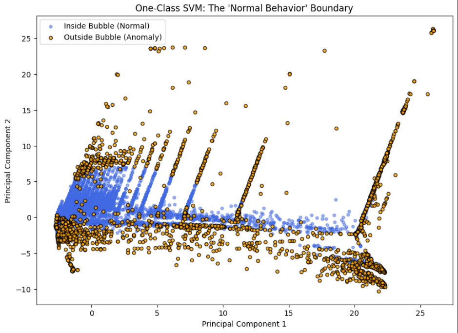

# Network Anomaly Detection: Model Training Report

## 1. Project Overview
This project implements an unsupervised machine learning approach to detect network intrusions. Given the absence of labeled data, three distinct algorithms were deployed to identify suspicious patterns based on **Density**, **Isolation**, and **Boundary** logic.

---

## 2. Experimental Setup
* **Data Transformation:** * Numerical columns processed via `Log1p` and `RobustScaler`.
    * Categorical columns handled via `OneHotEncoder` and `BinaryEncoder`.
* **Testing Strategy:** Unsupervised evaluation using Silhouette Scores and Model Consensus.
* **Contamination Factor:** 0.1 (Targeting top 10% of anomalies).

---

## 3. Model Performance Comparison

| Metric | Local Outlier Factor (LOF) | Isolation Forest (IF) | One-Class SVM (OCSVM) |
| :--- | :--- | :--- | :--- |
| **Logic Type** | Density-Based | Tree-Based Isolation | Support Vector Boundary |
| **Training Speed** | Moderate | **Fastest** | **Slowest** |
| **Memory Usage** | High (Lazy Learner) | Low | Moderate |
| **Silhouette Score** | **0.11** | **0.56** | **0.63** |
| **Detection Goal** | Localized deviations | Global outliers/extremes | Violation of "Normal" bubble |

---

## 4. Key Findings & Analysis

### A. Isolation Forest (Primary Model)
- **Efficiency:** The model handled 500 estimators with high speed, making it the most viable for real-time traffic monitoring.
- **Sensitivity:** Best at catching "Global Outliers" (e.g., massive data exfiltration or high-frequency pings).
- **Visualization:** PCA plots showed anomalies forming distinct "tails" away from the central traffic mass.

### B. One-Class SVM (Boundary Model)
- **Observation:** Effectively defined the "frontier" of normal network behavior.
- **Drawback:** Significant training latency. Due to $O(n^2)$ complexity, it is better suited for offline forensic analysis than live detection.

### C. Local Outlier Factor (Density Model)
- **Observation:** Yielded a Silhouette Score of **0.11**, indicating a dense overlap between normal and suspicious traffic. 
- **Role:** Crucial for detecting stealthy, low-volume attacks that blend in with global averages but look "lonely" in their local neighborhood.

---

## 5. The Consensus Evaluation (Ground Truth Proxy)
Since labels were unavailable, the model's reliability was verified through **Inter-Model Agreement**:

> **High-Confidence Result:** 550 network events were flagged as anomalies by **all three models**. 

This triple-consensus acts as a high-probability "Attack List," as the detected events violated density, isolation, and boundary rules simultaneously.

---

## 6. Final Recommendations
1. **Model Selection:** Deploy the **Isolation Forest** for real-time detection due to its computational efficiency.
2. **Alert Strategy:** Use the **Decision Function** scores to categorize alerts into "Critical" (Negative scores from 3 models) and "Suspicious" (Negative score from 1 model).
3. **Preprocessing:** Retain the `Log1p` transformation, as it successfully minimized the impact of highly skewed network feature distributions.

---

## 7. PCA Projection Comparison

| Isolation Forest (Global Outliers) | One-Class SVM (Boundary) |
| :---: | :---: |
 | |  |
| *Focuses on points that are mathematically "far" from the center.* | *Focuses on points that violate the "shape" of normal traffic.* |